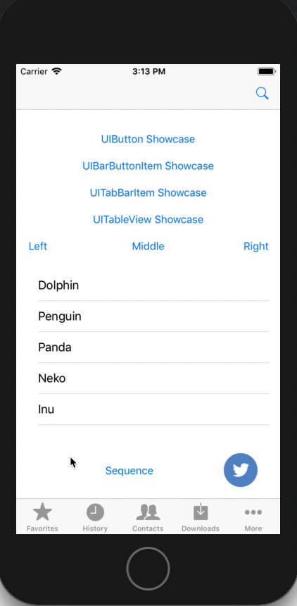

1.  [OneFrameMobile](index.html)
2.  [Components](Components_9601453.html)
3.  [Showcase](Showcase_42402321.html)

# OneFrameMobile : Showcase - IOS

Created by Unknown User (02484320), last modified on 30 May, 2019

*   ##### [Introduction](#Showcase-IOS-Introduction)

*   ##### [Getting Started](#Showcase-IOS-GettingStarted)

*   ##### [Requirement](#Showcase-IOS-Requirement)

*   ##### [Showcase](Showcase---IOS_51577043.html)

    *   [UI Options](#Showcase-IOS-UIOptions)
    *   [UIView Case](#Showcase-IOS-UIViewCase)
    *   [UITableView Case](#Showcase-IOS-UITableViewCase)
    *   [UITabBarItem Case](Showcase---IOS_51577043.html)
    *   [UIBarButton Case](#Showcase-IOS-UIBarButtonCase)
*   **[Sequence](#Showcase-IOS-Sequence)**

*   **[Release Notes](RELEASE_NOTES.md)**

# Introduction

Showcase library spots a given view. It can be used to highlight new features.

You can download sample application or look at bellatrix repository.

[ShowcaseSample.zip](.documentation/51577045.zip)

# Getting Started

[CocoaPods](http://cocoapods.org/)  is a dependency manager for Cocoa projects. You can install it with the following command:

$ gem install cocoapods

> CocoaPods 1.1+ is required to build  1.0

To integrate KSNetwork into your Xcode project using CocoaPods, specify it in your `Podfile`:

source '[https://github.com/CocoaPods/Specs.git](https://github.com/CocoaPods/Specs.git) ' platform :ios, '10.0' use_frameworks!

target 'Target Name' do

**pod 'Showcase' , :git => '[http://bellatrix:8080/tfs/ArgeMimariCollection/OneFrameIOS/_git/Showcase](http://bellatrix:8080/tfs/ArgeMimariCollection/OneFrameIOS/_git/Showcase)', :tag => '1.1.0****'**

 end

Then, run the following command:

$ pod install

# Requirement

*   iOS 10.0+ / macOS 10.10+ / tvOS 9.0+ / watchOS 2.0+
*   Xcode 9.0+
*   Swift 4+

# Showcase

## UI Options

Showcase have a lot options , primary text , circle color , tableview options ... 

**Basic GET**

<pre class="syntaxhighlighter-pre" data-syntaxhighlighter-params="brush: py; gutter: false; theme: Midnight" data-theme="Midnight">		showcase.setTargetView(view: button)
        showcase.primaryText = "Action 1"
        showcase.secondaryText = "Click here to go into details"
        showcase.shouldSetTintColor = false // It should be set to false when button uses image.
        showcase.backgroundPromptColor = UIColor.blue
        showcase.isTapRecognizerForTargetView = true
			showcase.show(completion: {
            print("==== completion Action 1.1 ====")
            // You can save showcase state here
        })</pre>

## UIView Case

You can use text , button or all UIView component will  use "tapTarget : view"  param. 

**UIView**

<pre class="syntaxhighlighter-pre" data-syntaxhighlighter-params="brush: py; gutter: false; theme: Midnight" data-theme="Midnight">   let showcase = Showcase()
        showcase.setTargetView(view: button)
        showcase.primaryText = "Action 1"
        showcase.secondaryText = "Click here to go into details"
        showcase.shouldSetTintColor = false // It should be set to false when button uses image.
        showcase.backgroundPromptColor = UIColor.blue
        showcase.isTapRecognizerForTargetView = true
		  showcase.show(completion: {
            print("==== completion Action 1.1 ====")
            // You can save showcase state here
        })</pre>

## UITableView Case

You can use Tableview will  use "tapTarget : tableView"  and could you add section and row param. 

**UITableView**

<pre class="syntaxhighlighter-pre" data-syntaxhighlighter-params="brush: py; gutter: false; theme: Midnight" data-theme="Midnight">        let showcase = Showcase()
        showcase.setTargetView(tableView: tableView, section: 0, row: 2)
        showcase.primaryText = "Action 3"
        showcase.secondaryText = "Click here to go into details"
        showcase.isTapRecognizerForTargetView = false
		  showcase.show(completion: {
            print("==== completion Action 1.1 ====")
            // You can save showcase state here
        })</pre>

## UIBarButton Case

You can use barButtonItem will use "tapTarget : view"  param. 

**UIBarButton**

<pre class="syntaxhighlighter-pre" data-syntaxhighlighter-params="brush: py; gutter: false; theme: Midnight" data-theme="Midnight">		let showcase = Showcase()
        showcase.setTargetView(barButtonItem: searchItem)
        showcase.targetTintColor = UIColor.red
        showcase.targetHolderRadius = 50
        showcase.targetHolderColor = UIColor.yellow
        showcase.aniComeInDuration = 0.3
        showcase.aniRippleColor = UIColor.black
        showcase.aniRippleAlpha = 0.2
        showcase.primaryText = "Action 2"
        showcase.secondaryText = "Click here to go into long long long long long long long long long long long long long long long details"
        showcase.secondaryTextSize = 14
        showcase.isTapRecognizerForTargetView = true
		  showcase.show(completion: {
            print("==== completion Action 1.1 ====")
            // You can save showcase state here
        })</pre>

##   
UITabBarItem Case

If use UITabbarItem will you can use "tabBar : view"  param and could you set itemIndex param. 

**Basic GET**

<pre class="syntaxhighlighter-pre" data-syntaxhighlighter-params="brush: py; gutter: false; theme: Midnight" data-theme="Midnight">   		let showcase = Showcase()
        showcase.setTargetView(tabBar: tabBar, itemIndex: 0)
        showcase.backgroundViewType = .circle
        showcase.targetTintColor = UIColor.clear
        showcase.targetHolderColor = UIColor.clear
        showcase.primaryText = "Action 3"
        showcase.secondaryText = "Click here to go into details"
        showcase.isTapRecognizerForTargetView = true
		  showcase.show(completion: {
            print("==== completion Action 1.1 ====")
            // You can save showcase state here
        })</pre>

# Sequence

This options use need three requirements.

1.  Declare many Showcase item.
    1.  Must set delegate self
2.  You will use page extends (Inheritance) ShowcaseDelegate
3.  Add ShowcaseDismiss function into sequence.showCaseWillDismis()

**You want app start run showcase sequence call sequence function viewDidAppear**

> Set sequence.once(key : "veli") param and sequence showcase only once show.

**Basic GET**

<pre class="syntaxhighlighter-pre" data-syntaxhighlighter-params="brush: py; gutter: false; theme: Midnight" data-theme="Midnight">    let sequence = ShowcaseSequence()
    override func viewDidAppear(_ animated: Bool) {
        let showcase3 = Showcase()
        showcase3.setTargetView(tableView: self.tableView, section: 0, row: 2)
        showcase3.primaryText = "Action 3"
        showcase3.secondaryText = "Click here to go into details"
        showcase3.isTapRecognizerForTargetView = false

        let showcase1 = Showcase()
        showcase1.setTargetView(view: button)
        showcase1.primaryText = "Action 1"
        showcase1.secondaryText = "Click here to go into details"
        showcase1.shouldSetTintColor = false // It should be set to false when button uses image.
        showcase1.backgroundPromptColor = UIColor.blue
        showcase1.isTapRecognizerForTargetView = true

        let showcase2 = Showcase()
        showcase2.setTargetView(barButtonItem: searchItem)
        showcase2.primaryText = "Action 1.1"
        showcase2.secondaryText = "Click here to go into details"
        showcase2.isTapRecognizerForTargetView = true

        showcase3.delegate = self
        showcase2.delegate = self
        showcase1.delegate = self
        //sequence.target(showcase1).target(showcase2).target(showcase3).once(key : "first").start()
        sequence.target(showcase1).target(showcase2).target(showcase3).start()
    }

extension ViewController : ShowcaseDelegate {
    func showCaseDidDismiss(showcase: Showcase, didTapTarget: Bool) {
        sequence.showCaseWillDismis()
    }
}

</pre>

## Attachments:

 [ShowcaseSample.zip](.documentation/51577175.zip) (application/zip)  
 [ShowcaseSample.zip](.documentation/51577045.zip) (application/zip)  
 [demoshow.gif](.documentation/51577177.gif) (image/gif)  

<section class="footer-body">

Document generated by Confluence on 26 Mar, 2021 11:14

[Atlassian](http://www.atlassian.com/)

</section>

